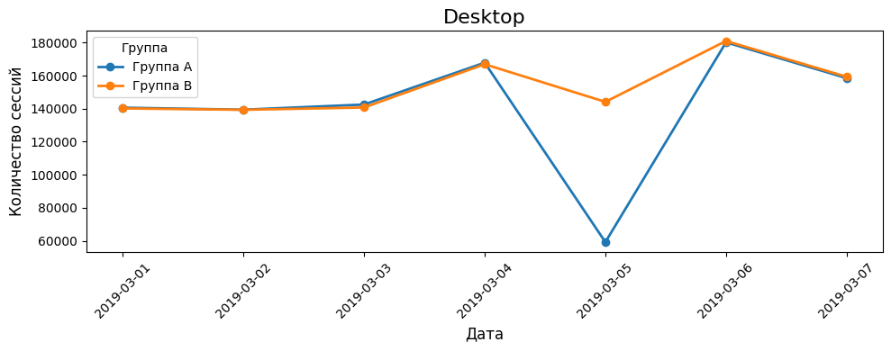
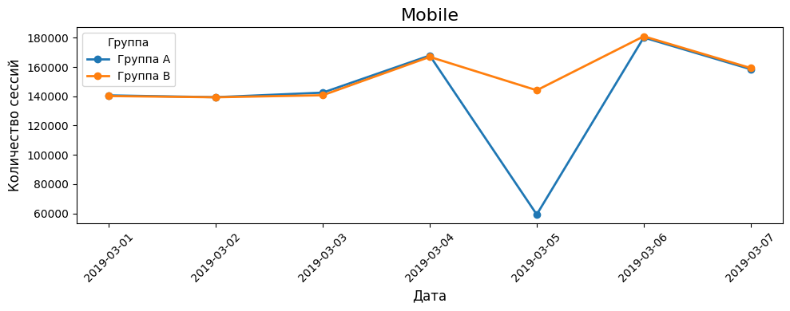
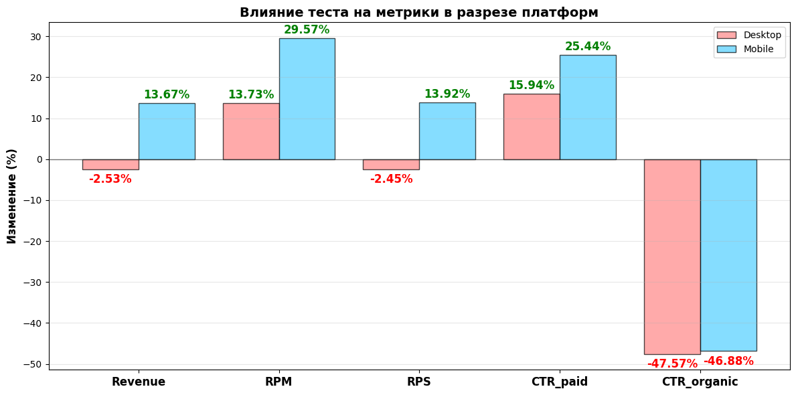
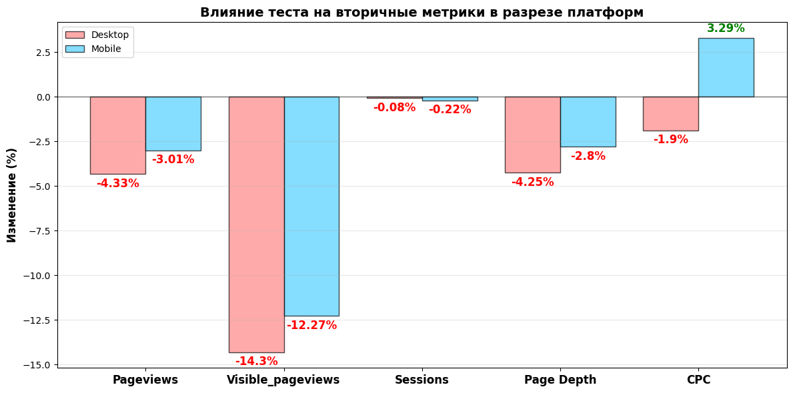

# Анализ A/B-теста: Влияние порядка элементов в ленте на монетизацию

## 📌 О проекте
**Краткое описание:**  
Исследование влияния расположения рекламных и органических элементов в ленте Marketpele Feed на ключевые метрики монетизации.

**Цель:**  
Определить, какой порядок элементов приносит больший доход при сохранении вовлеченности пользователей.

**Статус:**  
✅ Завершен (учебный проект)

---

## 📊 Данные
- **Источник:** выгрузка с платформы Marketpele (март 2019)
- **Период:** 01.03.2019 – 07.03.2019
- **Объем:** 126 записей
- **Основные поля:** `date`, `publisher_id`, `platform`, `group_name`, `sessions`, `visible_pageviews`, `revenue`, `sponsored_clicks`, `organic_clicks`

[Файл с выгрузкой](data/raw/marketpele_ab_test.xlsx) 

---

## 🔍 Этапы анализа

### 1. Предобработка и EDA
- Загрузка данных из Excel-файла
- Проверка пропусков и типов данных
- Анализ распределений по группам, платформам, издателям
- Сохранение данных в [data.csv](data/raw/data.csv)

📓 [Ноутбук: 01_eda.ipynb](notebooks/01_eda.ipynb)

### 2. Проверка корректности эксперимента (sanity checks)
- SRM-тест (баланс сессий между группами)
- Обнаружение аномалии 5 марта (разница в 23% на Desktop и 19% на Mobile)
- Исключение аномального дня из анализа

📓 [Ноутбук: 02_vlidatiin_checks.ipynb](notebooks/02_vlidatiin_checks.ipynb)

### 3. Оценка влияния на метрики
- Расчет CTR, CPC, RPM
- Статистические тесты (t-test, бутстрап)
- Анализ по платформам (Desktop / Mobile)

📓 [Ноутбук: 03_analysis.ipynb](notebooks/03_analysis.ipynb)

### 4. Интерпретация и выводы
- Формулировка рекомендаций
- Описание ограничений

📄 [Полный отчет (PDF)](reports/final_report.pdf)

### 5. Презентация для бизнеса
- [Презентация](reports/AB_test.pptx)
- [Расчет RICE](reports/RICE.xlsx)

---

## 📈 Ключевые результаты

### Desktop страта

| Метрика | Группа A | Группа B | Изменение | p-value |
|---------|----------|----------|-----------|---------|
| CTR (реклама) | 5.37% | 6.23% | **+15.94%** | **0.028** |
| RPM | $4.82 | $5.48 | **+13.73%** |**0.000**|
| Revenue | $1075.51 | $1048.26 | -2.53% | - |
| RPS | $3.09 | $3.01 | -2.45%  | 1.0 |
| CPC | $0.0897 | $0.0880 | --1.9% | - |
| CTR (органическая) | 18.99% | 9.96% | **-47.57%** | 0.00|
| Visible PV | 223,296 | 191,359 | -14.3% | — |

**Основные выводы:**
- ✅ CTR реклама и RPM значително выросли (+15.9% и 13.7%) — реклама сверху привлекает больше кликов
- ⚠️ Revenue и CPC статистически не изменились — качество кликов осталось прежним
- ⚠️ Visible PV упал на 13.2%. Именно это стало причиной, что клики выросли, доход на 1000 просмотров вырос, но прибыль осталась таже.
- ❌CTR органика упала на 47.6%. Что является недопустимым при работе с партнерами

### Mobile страта

| Метрика | Группа A | Группа B | Изменение | p-value |
|---------|----------|----------|-----------|---------|
| CTR (реклама) | 6.68% | 8.38% | **+25.4%** | **0.000** |
| RPM | $6.26 | $8.11 | **+29.6%** | **0.000** |
| Revenue | $1501.9 | $1707.25 | +13.67% | - |
| RPS | $2.59 | $2.95 | **+13.90%**  | **0.000** |
| CPC | $0.0937 | $0.0968 | +3.3% | - |
| CTR (органическая) | 18.99% | 9.96% | **-46.8%** | 0.00|
| Visible PV | 240,052 | 210,594 | -12.27% | — |

**Основные выводы:**
- ✅ CTR реклама, RPM, Revenue значително выросли (+25.4%, 29.6%, 13.67%) — реклама сверху привлекает больше кликов, прибыль выросла
- ⚠️ CPC незначительно подрос — качество кликов улучшилось.
- ⚠️ Visible PV упал на 12.3%. Именно это стало причиной, что клики выросли более чем на 25%, а прибыль всего на 13,7%.
- ❌CTR органика упала на 46.8%. Что является недопустимым при работе с партнерами

---

## 🖼 Визуализации

### Баланс сессий по дням

*Обнаружение аномалии 5 марта. Данные были исключены*

### Влияние теста на метрики

*CTR, CPC и RPM*

*Pageviews, Visible_pageviews, Sessions, Page Depth, CPC*

---

## 🛠 Используемые инструменты
- **Python:** pandas, numpy, scipy, matplotlib, seaborn,statsmodels
- **Статистика:** t-test, хи-квадрат, бутстрап,statsmodels,sklearn.linear_model
- **Визуализация:** matplotlib, seaborn

---

## 📁 Структура репозитория
├── data/
│ ├── raw/ # исходные данные
│ ├── processed/ # очищенные данные
├── notebooks/
│ ├── 01_eda.ipynb
│ ├── 02_sanity_checks.ipynb
│ └── 03_analysis.ipynb
├── reports/
│ └── final_report.pdf # полный отчет
├── images/ # графики для README
└── README.md

---

## 🚀 Как воспроизвести анализ
1. Клонировать репозиторий
2. Запустить Jupyter Notebooks в порядке нумерации

---

## 👤 Автор
**Антипов Денис**  

---

## 📄 Лицензия
Проект выполнен в учебных целях. Данные синтетические/обезличенные.